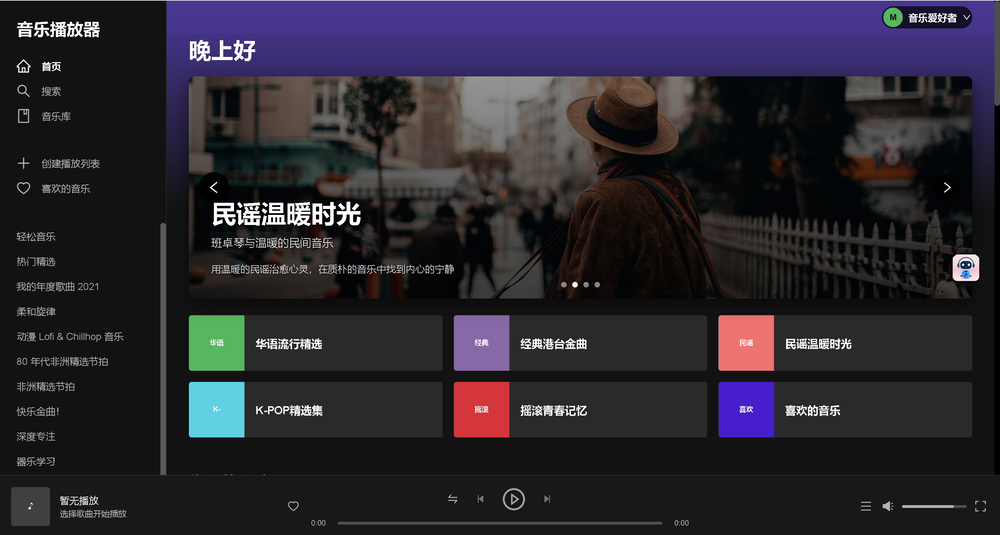
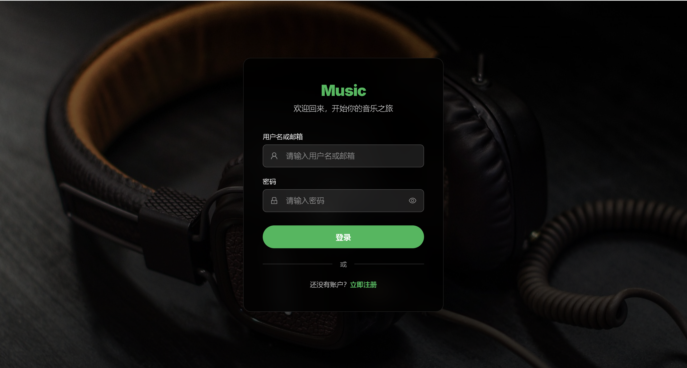
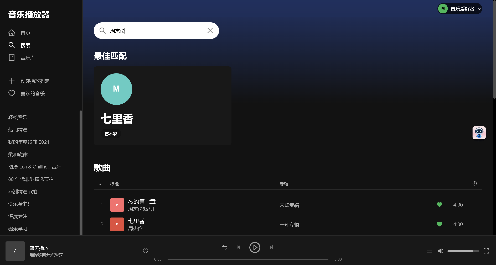
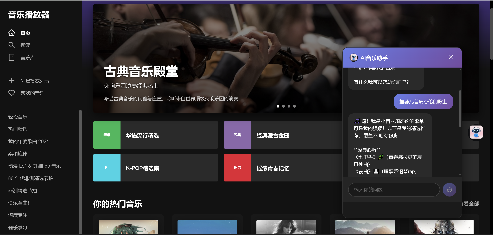
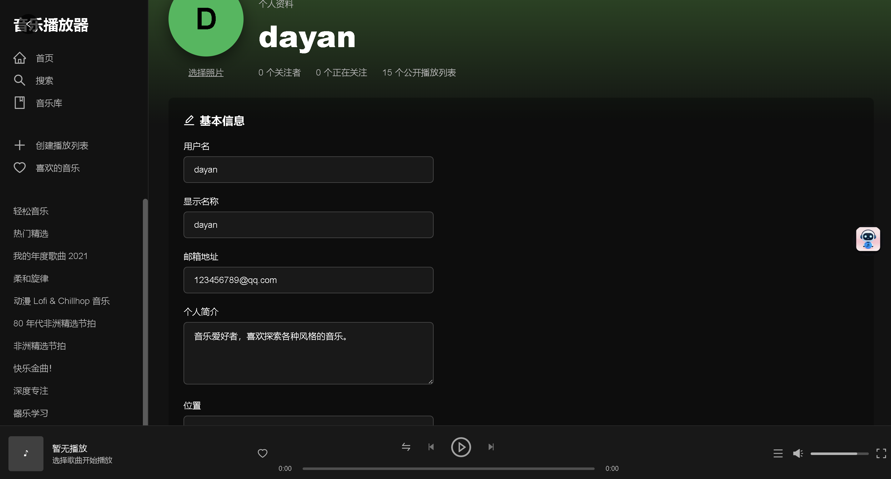

# 🎵 音乐播放器 Web 应用

一个功能完整的现代音乐网站，采用前后端分离架构，UI 设计参考 Spotify，提供流畅的音乐播放体验。


## ✨ 项目特色

- 🔥 **完整音乐功能** - 播放控制、列表管理、收藏系统、评论互动
- 🚀 **前后端分离** - React + Spring Boot，技术栈现代化
- 🤖 **AI 聊天助手** - 集成 DeepSeek AI，提供智能音乐推荐和问答
- 🔐 **用户系统** - 完整的登录注册、个人资料管理
- 📱 **响应式设计** - 支持桌面端和移动端

## 🏗️ 项目架构

```
music-web2/
├── music-web-frontend/          # React 前端应用
│   ├── src/
│   │   ├── components/          # 可复用组件
│   │   ├── pages/              # 页面组件
│   │   ├── store/              # Redux 状态管理
│   │   ├── services/           # API 服务
│   │   └── types/              # TypeScript 类型
│   └── package.json
│
├── music-web-backend/           # Spring Boot 后端服务
│   ├── src/main/java/com/music/ # Java 源码
│   ├── src/main/resources/     # 配置文件
│   ├── sql/                    # 数据库脚本
│   └── data/                   # 静态资源文件
│       ├── song/               # 音频文件
│       ├── img/                # 图片资源
│       └── avatorImages/       # 用户头像
│
└── README.md                    # 项目说明文档
```

## 🌟 主要功能

### 🎵 音乐播放
- **完整播放器控制**：播放/暂停、上一首/下一首、进度条拖拽
- **播放模式切换**：顺序播放、随机播放、单曲循环、列表循环  
- **音量控制**：音量调节、一键静音
- **播放队列**：队列管理、快速跳转

### 👤 用户系统
- **用户认证**：登录、注册、会话管理
- **个人资料**：头像上传、信息编辑
- **收藏管理**：收藏歌曲、创建播放列表

### 🔍 搜索与发现
- **智能搜索**：歌曲、歌手、专辑搜索
- **分类浏览**：按流派、热度浏览音乐
- **个性化推荐**：基于用户喜好的推荐

### 💬 社交互动
- **评论系统**：歌曲和播放列表评论
- **点赞功能**：评论点赞/取消点赞
- **AI 助手**：智能音乐推荐和问答

### 🎨 界面体验
- **现代化 UI**：仿 Spotify 深色主题设计
- **响应式布局**：完美适配各种屏幕尺寸
- **流畅动画**：丰富的交互动画效果

## 🛠️ 技术栈

### 前端技术
- **框架**: React 18 + TypeScript
- **构建工具**: Vite
- **状态管理**: Redux Toolkit
- **UI 组件**: Ant Design + Styled-Components
- **路由**: React Router v6
- **HTTP 客户端**: Axios

### 后端技术
- **框架**: Spring Boot 2.7+
- **数据库**: MySQL 8.0
- **ORM**: MyBatis Plus
- **认证**: Session-based Authentication
- **AI 集成**: DeepSeek API

### 开发工具
- **版本控制**: Git
- **代码规范**: ESLint + Prettier
- **API 文档**: Swagger

## 🚀 快速开始

### 环境要求
- Node.js 16+
- Java 8+
- MySQL 8.0+
- Maven 3.6+

### 1. 克隆项目
```bash
git clone https://github.com/ZZ-zz123/music-web.git
cd music-web2
```

### 2. 数据库配置
```sql
-- 创建数据库
CREATE DATABASE music_web DEFAULT CHARSET=utf8mb4;

-- 导入数据
mysql -u root -p music_web < music-web-backend/sql/init.sql
```

### 3. 后端启动
```bash
cd music-web-backend

# 配置 application.yml 中的数据库连接和 DeepSeek API Key
# spring.datasource.url=jdbc:mysql://localhost:3306/music_web
# deepseek.api.key=your_deepseek_api_key

# 启动后端服务
mvn spring-boot:run
```

### 4. 前端启动
```bash
cd music-web-frontend

# 安装依赖
npm install

# 启动开发服务器
npm run dev
```

### 5. 访问应用
- 前端地址：http://localhost:5173
- 后端地址：http://localhost:8080
- API 文档：http://localhost:8080/swagger-ui.html

## 📋 功能清单

### ✅ 已完成功能
- [x] 用户注册登录系统
- [x] 音乐播放器（完整播放控制）
- [x] 歌曲搜索和分类浏览
- [x] 播放列表管理
- [x] 收藏和评论系统
- [x] AI 聊天助手（DeepSeek 集成）
- [x] 响应式界面设计
- [x] 歌词显示功能

### 🚧 暂未开发功能
- [ ] **管理员平台**
- [ ] 部分歌手图片及歌单未设置
  


## 📸 项目截图

### 主界面
<div align="center">
  
  <p><em>音乐播放器主界面 </em></p>
</div>

### 登录界面
<div align="center">
  
  <p><em>登录界面</em></p>
</div>

### 搜索功能
<div align="center">
  
  <p><em>智能搜索 - 歌曲、歌手、专辑搜索</em></p>
</div>

### AI 聊天助手
<div align="center">
  
  <p><em>AI 聊天助手 - 智能音乐推荐和问答</em></p>
</div>


### 用户系统
<div align="center">
  
  <p><em>用户个人中心 - 完整的用户管理功能</em></p>
</div>

## 🤝 贡献指南

欢迎贡献代码！请遵循以下步骤：

1. Fork 项目仓库
2. 创建功能分支：`git checkout -b feature/AmazingFeature`
3. 提交更改：`git commit -m 'Add some AmazingFeature'`
4. 推送分支：`git push origin feature/AmazingFeature`
5. 提交 Pull Request

### 开发规范
- 遵循现有代码风格
- 添加必要的注释
- 编写单元测试
- 更新相关文档

## 📝 开发日志

### v1.0.0 (当前版本)
- ✨ 完整的音乐播放功能
- ✨ 用户系统和认证
- ✨ AI 聊天助手
- ✨ 响应式界面设计

## 🐛 已知问题

- 管理员平台功能尚未开发
- 部分音频格式可能不支持
- 移动端部分交互有待优化

## 📞 联系方式

- 项目地址：[GitHub Repository]
- 问题反馈：[Issues]
- 功能建议：[Discussions]

## 📄 开源许可

本项目采用 MIT 许可证，详情请见 [LICENSE](LICENSE) 文件。

## 🙏 致谢

- [Spotify](https://www.spotify.com/) - UI 设计灵感
- [React](https://reactjs.org/) - 前端框架
- [Spring Boot](https://spring.io/projects/spring-boot) - 后端框架
- [Ant Design](https://ant.design/) - UI 组件库
- [DeepSeek](https://www.deepseek.com/) - AI 技术支持

---

⭐ 如果这个项目对你有帮助，请给个 Star 支持一下！
